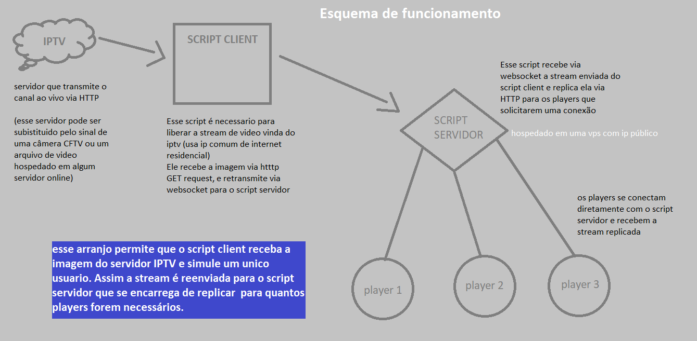

# Retransmissão de canal IPTV
#### Script simples de exemplo que recebe o sinal de um canal iptv e retransmite ele via websocket para que outro servidor faça a replicação da stream para múltiplos players via HTTP

### Qual a motivação para criar esse script?
 - Estava eu assistindo iptv e me veio à mente que era chato não poder compartilhar um canal iptv para outras pessoas usando o meu login
 - Então criei esse script na tentativa de replicar o sinal de um canal que gosto para múltiplos players

### Porque usar 2 scripts (client e server) ao invés de embutir tudo em um único script?
 - Minha ideia inicial era usar um único script que rodasse no servidor. esse script iria fazer o request do canal iptv, e retransmitir ele para os players que solicitassem. Porém em meus testes, percebi que os servidores de IPTV bloqueiam requisições vindas de IPs "gringos", ou de IPs atrelados a VPS/Cloud. Então a minha solução foi desmembrar o script em 2, assim o client faz o request do sinal iptv direto da minha internet domestica e retransmite essa stream para o script servidor rodando em uma VPS qualquer. Dessa forma o servidor se encarrega de replicar o sinal para os players.

### Quais outras aplicações desse projeto?
 - Transmitir a imagem de uma câmera IP local para um servidor em nuvem e posteriormente essa imagem ser acessada por múltiplos players ou mesmo para que um computador remoto receba a stream e armazene em arquivos.
 - Transmitir arquivos grandes via websocket para múltiplos computadores em rede (necessita adaptações maiores)
 - Transmitir um filme hospedado online para vários usuários (necessita adaptações)

### O que esse projeto NÃO FAZ?
 - Esse projeto não converte a stream em vídeo diretamente
 - Esse projeto não pirateia sinal de TV
 - Esse projeto não transmite múltiplos canais (ou uma lista M3U completa)
 - Esse projeto não é estritamente para transmissão de vídeo, apesar de ser possível fazer isso.
 - **A única coisa que esse projeto faz é receber os dados de uma fonte HTTP e retransmitir ela para outro servidor e posteriormente para outros clientes (esses dados podem ser arquivos ou mesmo streaming de video HTTP/RTSP/Outro)**

### Esquema visual de funcionamento

### Em funcionamento compartilhando o canal IPTV

- *No exemplo acima, o script server está hospedado em uma VPS Oracle BR (distante de mim). o script client está em meu computador. mesmo abrindo 3 players simultâneos, não percebi travamento na transmissão vinda do servidor remoto, o que indica que a transmissão de saída (script client) está fluida e sem engasgos*
- *Obviamente podem ocorrer engasgos dependendo da qualidade da internet local onde o client está rodando. Porém todo o processo usou pouca banda para as transmissões.*

**Esse projeto não incentiva pirataria! é APENAS para fins didáticos e de aprendizado sobre streams, websocket e transmissões http**
 *Desenvolvido com Node.JS*
